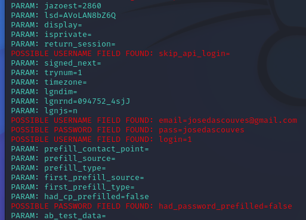

# cibersecurity-desafio-phising-Victor-Taveira

Foi feito usando `setuptool` uma abordagem da família de engenharia social, fazendo um website clonado do `facebook`para colher as credenciais digitais.

            . USERNAME: `josedascouves@gmail.com`
            . SENHA: `josedascouves`

